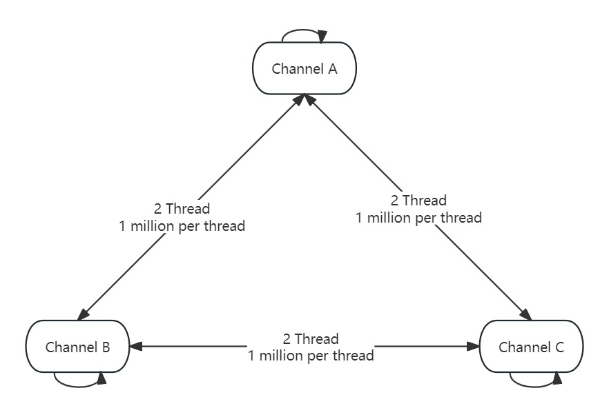
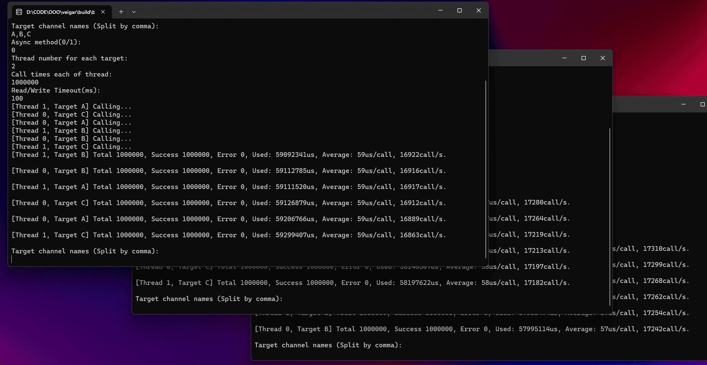

[ >>> 简体中文版](README_CN.md)

# 1. Veigar
The term 'Veigar' comes from the 'The Tiny Master of Evil' in League of Legends.


Veigar is a cross platform remote procedure call (RPC) framework, supports Windows and Linux platforms.

Veigar is implemented based on shared memory technology and only supports remote procedure calls between native processes or threads, which is the biggest difference between Veigar and other RPC frameworks such as Thrift and grpc.

> So far as I know, Veigar is the first open source RPC framework based on shared memory technology.

# 2. Advantage
Compared to other RPC frameworks, Veigar's advantages is that:

- Expose functions of your program to be called via RPC (from any language implementing msgpack-rpc).

- Call functions through RPC (of programs written in any language).

- No IDL to learn.

- No code generation step to integrate in your build, just C++.

- No concept of server and client, and each Veigar instance can call each other.

- No network issue, such as being occupied or being semi closed.

- No strange port pseudo availability issues (especially in Windows).

# 3. Compile
Although Veigar's underlying implementation is based on msgpack and boost interprocess, we have included these two libraries in the project and do not require additional installation when using them.

Veigar only supports compiling to static libraries.

CMake can be used for compilation and build, or using [vcpkg](https://github.com/microsoft/vcpkg) to install:

```bash
vcpkg install veigar
```

# 4. Quick Start
Although Veigar's underlying implementation is based on msgpack, Veigar have included this library in the project and do not require additional installation.

Veigar only supports compiling to static libraries.

When using Veigar, simply include the `include` directory in the project and link Veigar's static library.

## 4.1 Synchronous Call

Here is an example of synchronous call:

> In order to make the code more concise, this example did not verify the return value of the function. Please do not do this in practical use!

```cpp
#include <iostream>
#include "veigar/veigar.h"

int main(int argc, char** argv) {
    if (argc != 3) {
        return 1;
    }

    std::string channelName = argv[1];
    std::string targetChannelName = argv[2];

    veigar::Veigar vg;

    vg.bind("echo", [](const std::string& msg, int i, double d, std::vector<uint8_t> buf) {
        std::string result;
        // ...
        return result;
    });

    vg.init(channelName);

    std::vector<uint8_t> buf;
    veigar::CallResult ret = vg.syncCall(targetChannelName, 100, "echo", "hello", 12, 3.14, buf);
    if (ret.isSuccess()) {
        std::cout << ret.obj.get().as<std::string>() << std::endl;
    }
    else {
        std::cout << ret.errorMessage << std::endl;
    }

    vg.uninit();

    return 0;
}
```

Each Veigar instance has a channel name that is unique within the current computer scope. When calling the `init` function, the channel name needs to be specified for the Veigar. Veigar does not detect the uniqueness of the channel, and the caller needs to ensure the uniqueness of the channel name.

In the above example, it is necessary to specify the channel name of the current instance and the channel name of the target instance through command line parameters, such as:

```bash
sample.exe myself other
```

Each instance bind a function named `echo`, which simply returns the msg parameter string as is.

By specifying the `syncCall` function with 'target channel name', 'function name', 'function parameters', and 'timeout milliseconds', the target function can be synchronously called and the call result obtained.

## 4.2 Reject exceptions

I don't like exceptions, so Veigar doesn't throw errors in the form of exceptions. Veigar actively catches all C++ standard libraries, msgpack, and boost exceptions, and returns them to the caller as return values. When the call fails (`!ret.isSuccess()`), the error information stored in the `errorMessage` may be the exception information captured by Veigar.

## 4.3 Asynchronous Call

Asynchronous call can be implemented using the `asyncCall` function.

The following is an example of asynchronous call:

```cpp
//
// Same as synchronous call
// ...
std::vector<uint8_t> buf;
std::shared_ptr<veigar::AsyncCallResult> acr = vg.asyncCall(targetChannelName, "echo", "hello", 12, 3.14, buf);
if (acr->second.valid()) {
    auto waitResult = acr->second.wait_for(std::chrono::milliseconds(100));
    if (waitResult == std::future_status::timeout) {
        // timeout
    }
    else {
        veigar::CallResult ret = std::move(acr->second.get());
        if(ret.isSuccess()) {
            std::cout << ret.obj.get().as<std::string>() << std::endl;
        }
        else {
            std::cout << ret.errorMessage << std::endl;
        }
    }
}

vg.releaseCall(acr->first);

//
// Same as synchronous call
// ...
```

Unlike synchronous calls, the `asyncCall` function return `std::shared_ptr<veigar::AsyncCallResult>`, and the caller needs to call the `releaseCall` function to release resources when obtaining the `CallResult` or when the call result is no longer related.

# 5. Performance

Use the `examples\echo` program as a test case.

Start three channels A, B, and C, each channel calling each other 1 million times using two threads:



## Windows Platform Test Results

Test machine CPU configuration：
```txt
12th Gen Intel(R) Core(TM) i7-12700H   2.30 GHz
```

Test result：

```txt
Target channel names (Split by comma):
A,B,C
Async method(0/1):
0
Thread number for each target:
2
Call times each of thread:
1000000
Read/Write Timeout(ms):
100
[Thread 1, Target A] Calling...
[Thread 0, Target C] Calling...
[Thread 0, Target A] Calling...
[Thread 1, Target B] Calling...
[Thread 0, Target B] Calling...
[Thread 1, Target C] Calling...
[Thread 1, Target B] Total 1000000, Success 1000000, Error 0, Used: 59092341us, Average: 59us/call, 16922call/s.

[Thread 0, Target B] Total 1000000, Success 1000000, Error 0, Used: 59112785us, Average: 59us/call, 16916call/s.

[Thread 1, Target A] Total 1000000, Success 1000000, Error 0, Used: 59111520us, Average: 59us/call, 16917call/s.

[Thread 0, Target C] Total 1000000, Success 1000000, Error 0, Used: 59126879us, Average: 59us/call, 16912call/s.

[Thread 0, Target A] Total 1000000, Success 1000000, Error 0, Used: 59206766us, Average: 59us/call, 16889call/s.

[Thread 1, Target C] Total 1000000, Success 1000000, Error 0, Used: 59299407us, Average: 59us/call, 16863call/s.
```

On average, it takes 59 microseconds per call and can be called approximately 16900 times per second.



